<div align="center">

<h1>
  <a href="https://misinformation-combater-frontend-386097269689.europe-west1.run.app" style="text-decoration: none; color: inherit;">
    
    <strong>BlueBrains: Misinformation Combater</strong>
  </a>
</h1>
 
*A system to flag likely misinformation and explain why—fast, simple, and (surprisingly) polite.*

</div>

---
**BlueBrains: Misinformation Combater** is an AI-powered platform that detects and analyzes misinformation across text, images, audio, PDFs, and URLs.  
It generates **detailed credibility reports** with clarity, tone, correctness, and originality scores, while also offering a **dashboard for authorities** featuring traffic trends, geographic heatmaps, category breakdowns, and source credibility insights.  

The system empowers users to fact-check quickly and enables authorities to track, analyze, and formally report misinformation at scale.  

<p>
  <a href="https://misinformation-combater-frontend-386097269689.europe-west1.run.app" target="_blank"><strong>Live Demo</strong></a> •
  <a href="https://github.com/SNprime24/misinfo" target="_blank"><strong>Frontend Repository</strong></a> •
  <a href="https://github.com/kumarutkarsh99/misinformation-combater-backend" target="_blank"><strong>Backend Repository</strong></a>
</p>

<p>
  
  
  
</p>

---

## Table of Contents

- [Tech Stack](#tech-stack)
- [Key Features](#key-features)
- [Project Structure](#project-structure)
- [Getting Started](#getting-started)
- [API Description](#api-description)
- [Contributors](#contributors)

## Tech Stack
This project leverages **Google Cloud Services** for APIs, database, and deployment, combined with modern web technologies like **FastAPI** and **ReactJS** to deliver a robust and scalable misinformation combating solution.

| Category           | Technologies                                                                                                                                                                                                                                                                                                                                 |
| ------------------ | -------------------------------------------------------------------------------------------------------------------------------------------------------------------------------------------------------------------------------------------------------------------------------------------------------------------------------------------- |
| **Frontend**       |        |
| **Backend**        |                                                                                                                                                                                                                                     |
| **Database**       |                                                                                                                                                                                                                                 |
| **Deployment**     |                                                                                                                                                                                                                         |
| **AI & APIs**      |    |

---

## Key Features

| 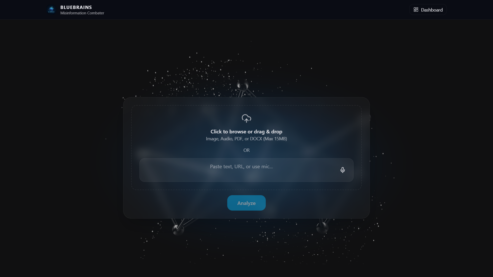 | 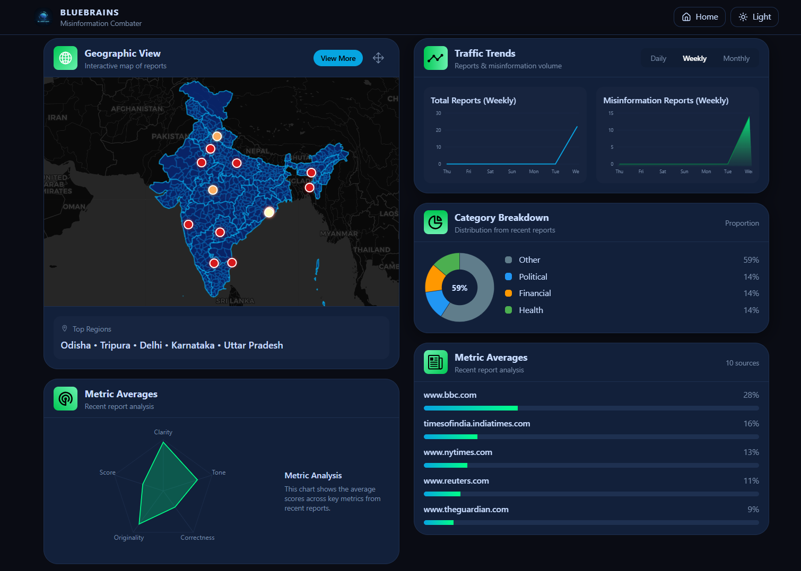 |
|--------------------------------|--------------------------------|
<p align="center">
  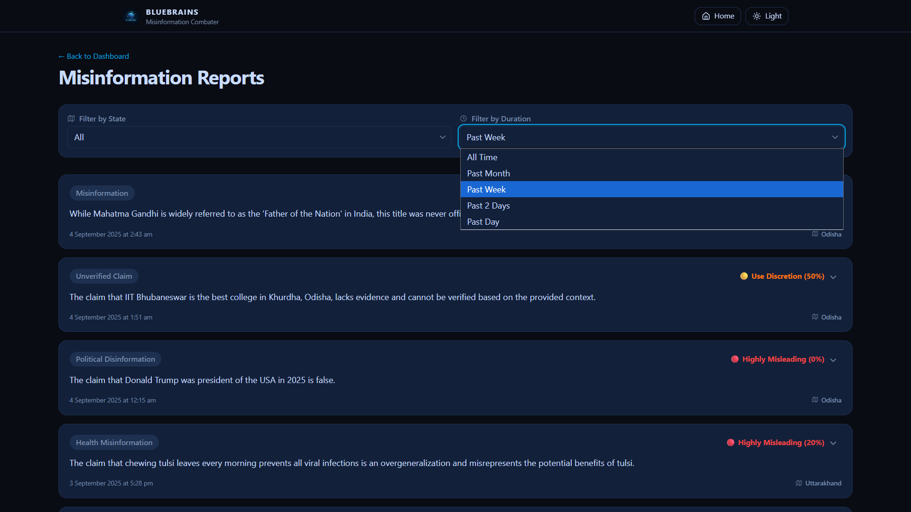
</p>

### 🎤 Multi-Modal Input Support
Users can submit information through **multiple input types**:
- 🎙️ Record or upload **audio**
- 📄 Upload **PDF documents**
- 🔗 Provide a **URL**
- ✍️ Enter **plain text**
- 🖼️ Upload an **image**

This ensures the platform handles diverse formats of misinformation spreading online.

| 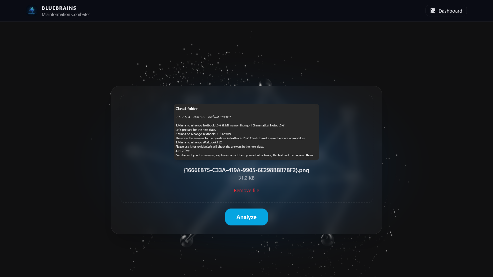 | 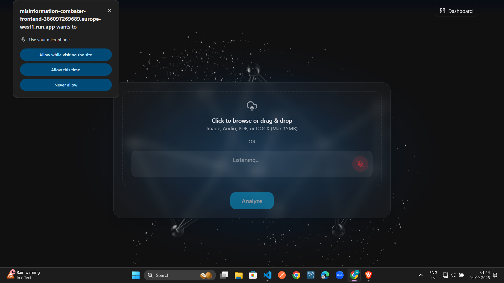 |
|-----------------------------------|------------------------------------|

---

### 📊 Comprehensive Report Generation
Every analysis produces a **detailed report** with multiple perspectives:
- ✅ **Credibility Score** — trustworthiness of the content  
- 🧾 **Clarity, Tone, Correctness, Originality** — in-depth linguistic + factual evaluation  
- 📝 **Report Summary** — simplified interpretation  
- 🔍 **Detected Entities** — people, organizations, places, keywords  
- 🌐 **Sources & Credibility** — cross-verified references from reliable sources  
- 🏛️ **Formal Reporting** — ability to **report suspicious content to authorities**  

| 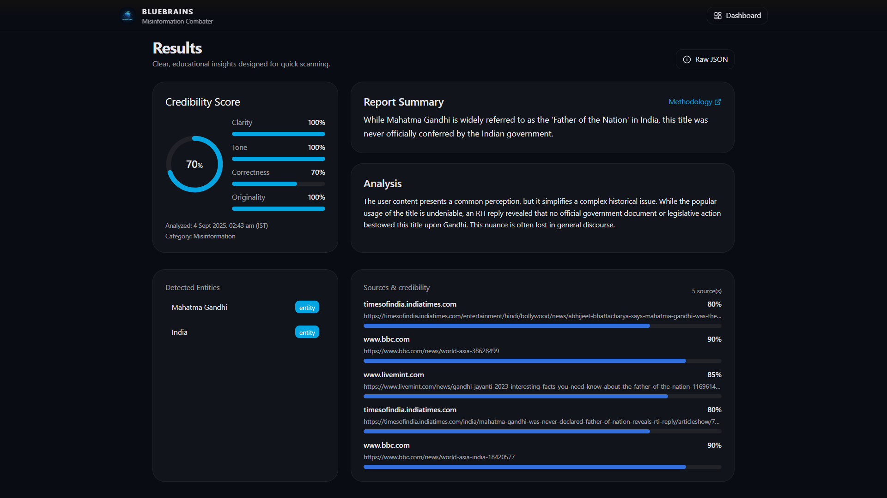 | 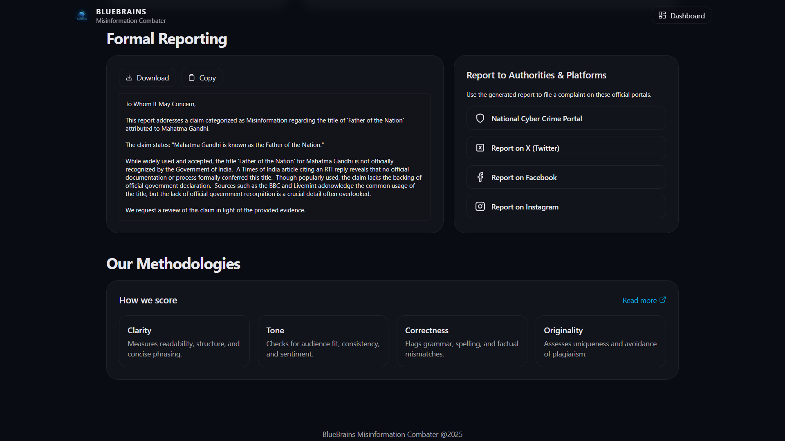 |
|-----------------------------------|------------------------------------|

---

### 🗺️ Authority Dashboard
A dedicated **dashboard for authorities and researchers** that provides real-time insights:
- 🗺️ **Geographic View (India map with points)** — see where misinformation originates and spreads  
- 📌 **Top Regions** — ranked by misinformation activity  
- 📈 **Metric Averages** — clarity, tone, credibility score, originality, correctness across all submissions  
- 📊 **Traffic Trends** — visualize total submissions vs. detected misinformation (daily, weekly, monthly)  
- 🥧 **Category Breakdown (Pie Chart)** — political, financial, health, other domains  
- 🔝 **Different Sources** — credibility rankings of top-5 most common misinformation sources  

| 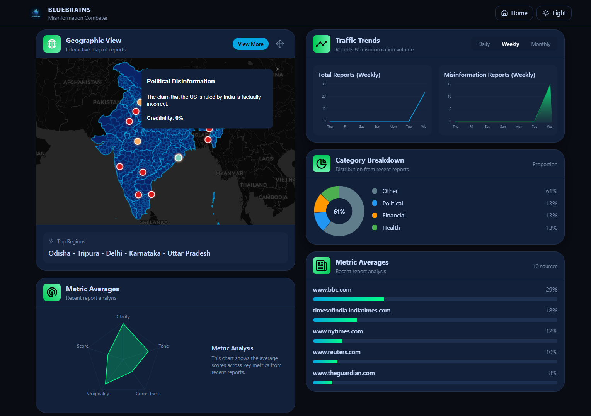 | 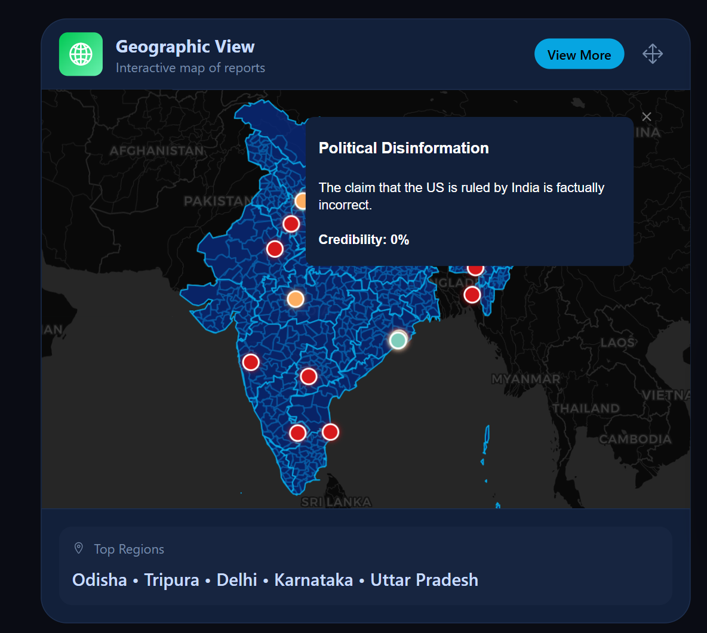 |
|----------------------------------|----------------------------------------|

---

### 🗂️ Misinformation Reports Page
A centralized **archive of all detected misinformation**:
- 🔎 **Filters by State** — drill down into specific regions  
- ⏳ **Filters by Time** — past day, 2 days, week, month  
- 📋 **Sorted Reports** — detailed entries with metadata, entities, and source credibility  

|  | 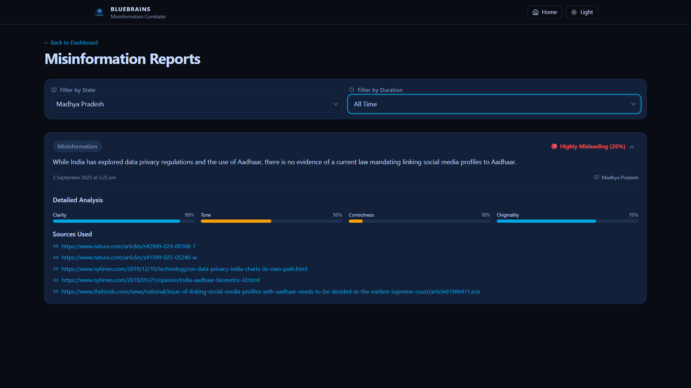 |
|--------------------------------------|--------------------------------------|

---

### 🎨 Multilingual Inputs & Light/Dark Mode
- 🌍 Supports **multilingual inputs** (local languages + English)  
- 🌗 **Light/Dark mode** switch for accessibility and better UX  

| 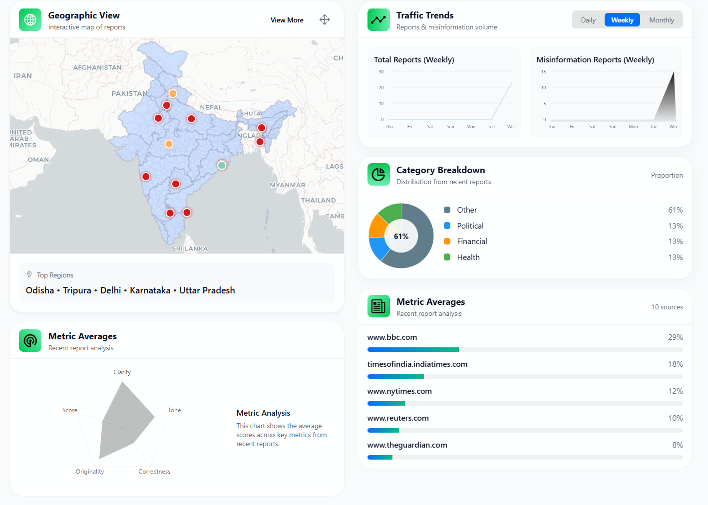 | 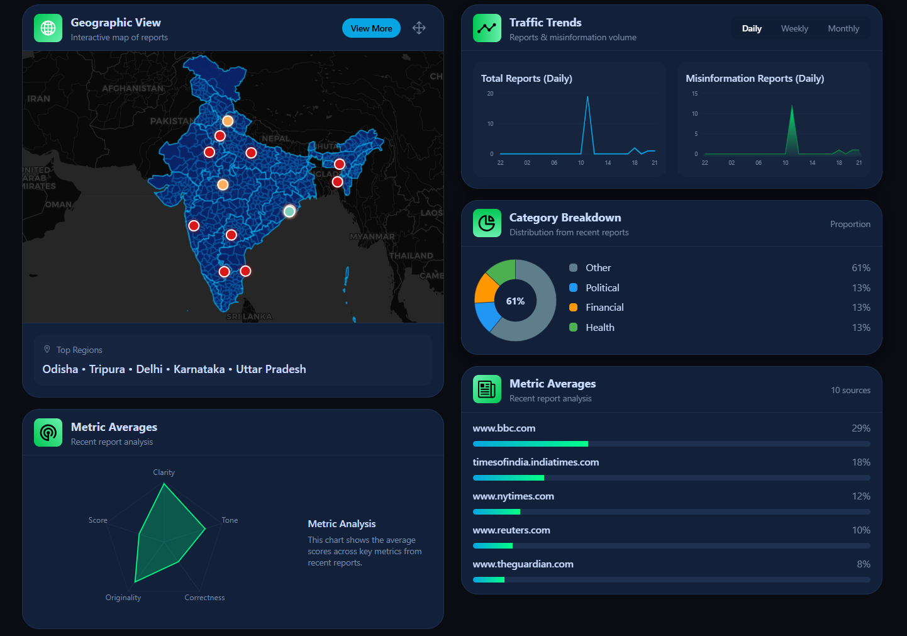 |
|------------------------------------|----------------------------------|

## Project Structure
The project is organized as a duo-repo with two main parts:

-   `/api`: Contains the entire backend (FastAPI application) 
-   `/client`: Contains the entire frontend React application.

```
    ├── api/
    │   ├── app/
    │   ├── .gitignore
    │   ├── Dockerfile
    │   ├── _init_.py
    │   └── requirements.txt
    └── client/
        ├── public/
        ├── src/
        │   ├── assets/
        │   ├── components/
        |   │   ├── charts/
        |   │   ├── sections/
        |   │   └── Graph.jsx
        │   ├── hooks/
        │   ├── pages/
        |   │   ├── Dashboard.jsx
        |   │   ├── Home.jsx
        |   │   └── ReportsPage.jsx
        │   ├── App.css
        │   ├── App.jsx
        │   ├── data.js
        │   ├── index.css
        │   └── main.jsx
        ├── .gitignore
        ├── eslint.config.js
        ├── index.html
        ├── package-lock.json
        ├── package.json
        └── vite.config.js
```

---

## Getting Started

Follow these steps to set up and run the project locally.

### 1️⃣ Clone the repositories
```bash
# Clone frontend
git clone https://github.com/SNprime24/misinfo.git client

# Clone backend
git clone https://github.com/kumarutkarsh99/misinformation-combater-backend.git api
```
### 2️⃣ Setup Environment Variables
Create a .env file inside the backend (/api) directory with the following keys:
```bash
SEARCH_API_KEY=your_google_custom_search_api_key
SEARCH_ENGINE_ID=your_search_engine_id
GCP_PROJECT=your_gcp_project_id
GCP_LOCATION=your_gcp_location
GEMINI_API_KEY=your_gemini_api_key
```

### 3️⃣ Run the Backend (FastAPI)
```bash
cd api
python3 -m venv .venv
source .venv/bin/activate  # macOS/Linux

pip install -r requirements.txt

uvicorn app.main:app --reload --host 0.0.0.0 --port 5000
```
Backend will start at:
👉 http://localhost:5000

### 4️⃣ Run the Frontend (React + Vite)
```bash
cd client
npm install
npm run dev
```
Frontend will start at:
👉 http://localhost:8080

### API Description
The backend API exposes several endpoints that the frontend can use.

```POST /api/analyze```
Analyze a given input (text, URL, image, pdf, or audio).

```GET /api/v1/trends/traffic```
Fetch traffic trends for misinformation reports over time.

```GET /api/v1/dashboard/heatmap```
Retrieve geographic distribution of misinformation cases.

```GET /api/v1/dashboard/recentReports```
Fetch the most recent misinformation reports.

```GET /api/v1/dashboard/categories```
Retrieve category breakdown of misinformation reports.

```GET /api/v1/trends/radar```
Fetch average metric values across all misinformation data.

```GET /api/v1/trends/sources```
Fetch top-5 misinformation sources ranked by credibility.

## Contributors

- Kumar Utkarsh
- Suprit Naik
- Harsh Maurya
- Adarsh Dhakar

---
